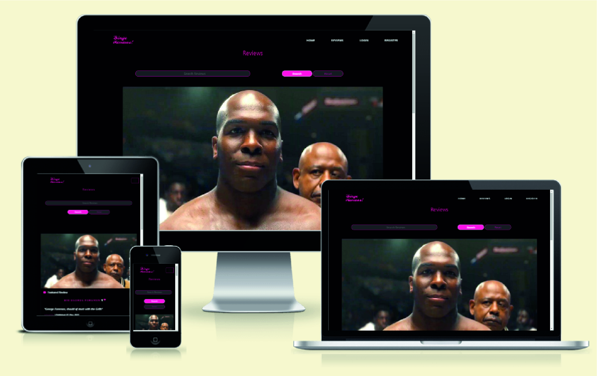
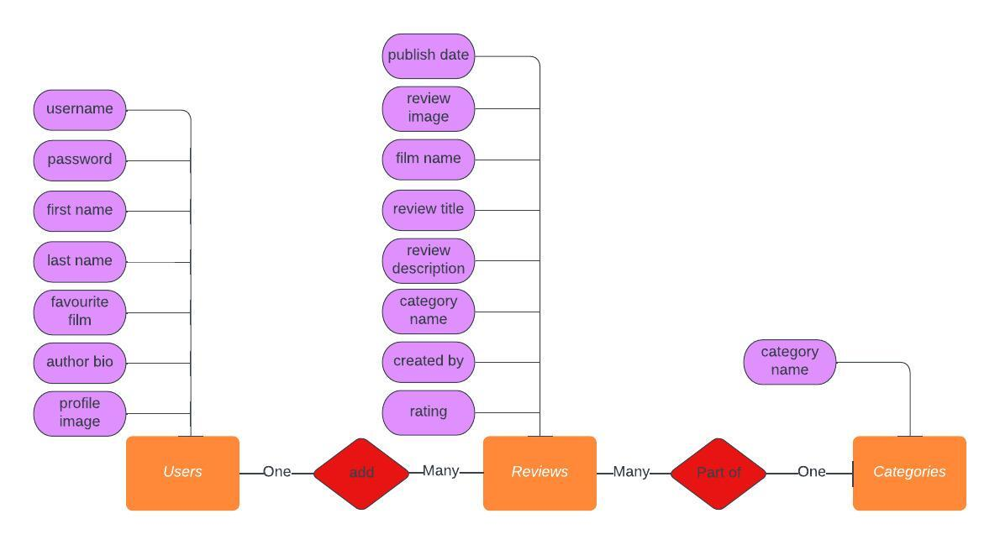
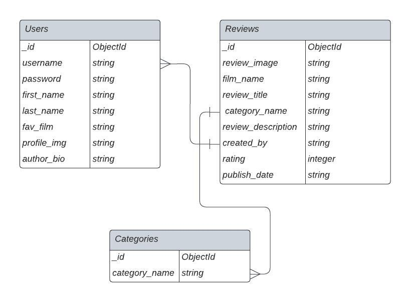
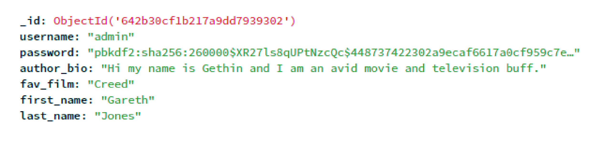
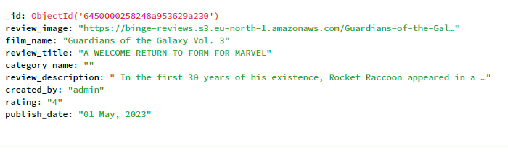

# Binge Reviews Web Application
Binge Reviews is a website that allows users to add/edit/delete/view reviews for films, it also allows the user to rate a film with a start rating of 1-5.
 
  

# Project Overview
- This project is a website that allows users to add/edit/delete/view reviews for films, it also allows the user to rate a film with a start rating of 1-5. This submission was created for milestone project 3 as part of the Code Institute - Diploma in Full Stack Software Development course.
- The repository on GitHub that contains the website source code and assets is available at this url: [Code Repository](https://github.com/GethinDavies1990/CI_MS3_DTR)
- The web application is built with a mobile first approach to allow for a responsive look and feel on all device types.
# UX
## Primary Goal
The primary goal of the website from the site owners perspective is:
- To create/edit/delete categories so users can add reviews to certain film genres.
- To allow users to add their own film reviews(review_image, film_name, review_title, category_name, review_description, created_by, rating, publish_date)
- To allow users to edit/update their own submitted reviews(film_name, review_title, category_name, review_description, rating)
- To allow users to delete their review
- To allow users to view reviews, and reviews submitted by other users

The primary goal of the website from a users perspective is:
- To allow users to add their own film reviews(review_image, film_name, review_title, category_name, review_description, created_by, rating, publish_date)
- To allow users to edit/update their own submitted reviews(film_name, review_title, category_name, review_description, rating)
- To allow users to delete their review
- To allow users to view reviews, and reviews submitted by other users
## Structure
I have structured the website into 18 pages, each with consistent styling throughout.

1. Home/Reviews: This is the landing page for the website.
2. Register: This page allows the user to register for the website and submit reviews. 
3. Login: This page allows users to login into the website
4. Profile: This page displays the users profile page.
5. Update profile: This page allows the user to edit their profile information.
6. Categories: This displays the categories page, this is only visible to an admin user to allow them to create/read/update/delete categories form the website. 
7. Add categories: This page allows the admin user to add more categories to the website
8. Edit Categories: This page allows the admin user to edit a category.
9. Add Review: This page allows the user to submit a review for a film.
10. Edit Review: This page allows the owner of a review to edit their review information. 
11. Delete Review: This button allows the user to remove their owned review from the website 
12. Reviews: This page displays all reviews submitted to the website. 
13. Review: This page displays the full review which has been submitted by a user. 
14. Error 400: This page is displayed to a user if they encounter an error 400
15. Error 404: This page is displayed if a user encounters a non existent url.
16. Error 401: This page is displayed if a user encounters an error 401
17. Error 405: This page is displayed if a user encounters an error 405
18. Error 500: This page is displayed if a user encounters an error 500

## Code Structure 
- My project was built using the Blueprints structure
- The blueprint structure is an object to structure a flask application into subsets. This helped keeping the site split into sections for organization and readability.
- This link here really helped me to understand how to structure my website using blueprints. https://realpython.com/flask-blueprint/
- The Project is structured as follows:
    - Authentication: Contains a flask route for authentication code, Register/Login/Profile etc.
    - Categories: Contains the routes for Adding categories, Edit Categories, and deleting categories. 
    - Errors: Contains the routes for error pages, 400, 401, 404, 405, 500
    - reviews: Contains the routes for the reviews code. add review, edit review, Delete review etc
    - Static
        - css( Styles css)
        - images ( images used in the project)
        - js ( Javascript used through the website)
    - Templates: includes all the templates structured into subset folders for each route. Authentication/Categories/Errors/Reviews.
    - Util: Code used to store the images in a AWS S3 bucket.
    - app.py: That sets and runs the application
    - a local env.py file, tha is not committed to source control - This ensures sensitive information is hidden in environment variables and never committed to repositories.

# Database 
- The website was built to be a data centric site, made with HTML, CSS, Javascript and the bootstrap framework was also used.
- The backend of the website consists of the Python language, The flask framework, Jinja templates and MongoDb was used to store the data.

## Database Model

The first step in setting up my database was to map out a conceptual data model. 

Once the concept data model was designed, I then created the physical database models within MongoDB

## MongoDB Database information
- One production database was created (binge_reviews) and it contains 3 collections
    1. users
    2. reviews
    3. categories
- A model.py file is included in the binge_reviews/models file to display the structure of the database in the python code. 
- The databases were created manually in MongoDB at first
- I then installed MongoDB connection directly into my IDE editor. This allowed me to check any data being added nto the database very quickly as opposed to logging into the mongodb website database each time. 

## Users

- The users collection is used to store user information when they register.
The fields stored when they register are.
    - Username(string) username
    - Password(string)  password
    - First Name(String) first_name
    - Last Name(string) last_name
    - Favorite Film(string) fav_film
    - Author Bio(string) author_bio
    - Profile Image(String) profile_img
- Password - The users password is encrypted using a generate_password_hash from the werkzeug.security Python library.

## Reviews

- The reviews is added by users of the website
- The fields stored in the collection are.
    - Review Image(string) review_image
    - Film Name(String) film_name
    - Review Title(string) review_title
    - Category Name(string) category_name
    - Review Description(string) review_description
    - Created by(string) created_by
    - Rating(Integer) rating
    - Publish Date(string) publish_date

