# Binge Reviews Web Application
Binge Reviews is a website that allows users to add/edit/delete/view reviews for films, it also allows the user to rate a film with a start rating of 1-5.
<br>
<br><br>


# Project Overview
- This project is a website that allows users to add/edit/delete/view reviews for films, it also allows the user to rate a film with a start rating of 1-5. This submission was created for milestone project 3 as part of the Code Institute - Diploma in Full Stack Software Development course.
- The repository on GitHub that contains the website source code and assets is available at this url: [Code Repository](https://github.com/GethinDavies1990/CI_MS3_DTR)
- The web application is built with a mobile first approach to allow for a responsive look and feel on all device types.
# UX
## Primary Goal
The primary goal of the website from the site owners perspective is:
- To create/edit/delete categories so users can add reviews to certain film genres.
- To allow users to add their own film reviews(review_image, film_name, review_title, category_name, review_description, created_by, rating, publish_date)
- To allow users to edit/update their own submitted reviews(film_name, review_title, category_name, review_description, rating)
- To allow users to delete their review
- To allow users to view reviews, and reviews submitted by other users

The primary goal of the website from a users perspective is:
- To allow users to add their own film reviews(review_image, film_name, review_title, category_name, review_description, created_by, rating, publish_date)
- To allow users to edit/update their own submitted reviews(film_name, review_title, category_name, review_description, rating)
- To allow users to delete their review
- To allow users to view reviews, and reviews submitted by other users
## Structure
I have structured the website into 18 pages, each with consistent styling throughout.

1. Home/Reviews: This is the landing page for the website.
2. Register: This page allows the user to register for the website and submit reviews. 
3. Login: This page allows users to login into the website
4. Profile: This page displays the users profile page.
5. Update profile: This page allows the user to edit their profile information.
6. Categories: This displays the categories page, this is only visible to an admin user to allow them to create/read/update/delete categories form the website. 
7. Add categories: This page allows the admin user to add more categories to the website
8. Edit Categories: This page allows the admin user to edit a category.
9. Add Review: This page allows the user to submit a review for a film.
10. Edit Review: This page allows the owner of a review to edit their review information. 
11. Delete Review: This button allows the user to remove their owned review from the website 
12. Reviews: This page displays all reviews submitted to the website. 
13. Review: This page displays the full review which has been submitted by a user. 
14. Error 400: This page is displayed to a user if they encounter an error 400
15. Error 404: This page is displayed if a user encounters a non existent url.
16. Error 401: This page is displayed if a user encounters an error 401
17. Error 405: This page is displayed if a user encounters an error 405
18. Error 500: This page is displayed if a user encounters an error 500

## Code Structure 
- My project was built using the Blueprints structure
- The blueprint structure is an object to structure a flask application into subsets. This helped keeping the site split into sections for organization and readability.
- This link here really helped me to understand how to structure my website using blueprints. https://realpython.com/flask-blueprint/
- The Project is structured as follows:
    - Authentication: Contains a flask route for authentication code, Register/Login/Profile etc.
    - Categories: Contains the routes for Adding categories, Edit Categories, and deleting categories. 
    - Errors: Contains the routes for error pages, 400, 401, 404, 405, 500
    - reviews: Contains the routes for the reviews code. add review, edit review, Delete review etc
    - Static
        - css( Styles css)
        - images ( images used in the project)
        - js ( Javascript used through the website)
    - Templates: includes all the templates structured into subset folders for each route. Authentication/Categories/Errors/Reviews.
    - Util: Code used to store the images in a AWS S3 bucket.
    - app.py: That sets and runs the application
    - a local env.py file, tha is not committed to source control - This ensures sensitive information is hidden in environment variables and never committed to repositories.

# Database 
- The website was built to be a data centric site, made with HTML, CSS, Javascript and the bootstrap framework was also used.
- The backend of the website consists of the Python language, The flask framework, Jinja templates and MongoDb was used to store the data.

## Database Model

The first step in setting up my database was to map out a conceptual data model. 

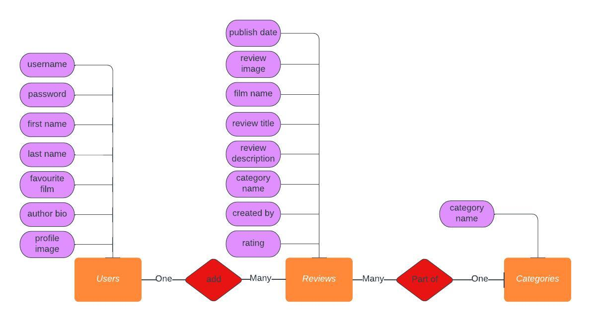

Once the concept data model was designed, I then created the physical database models within MongoDB

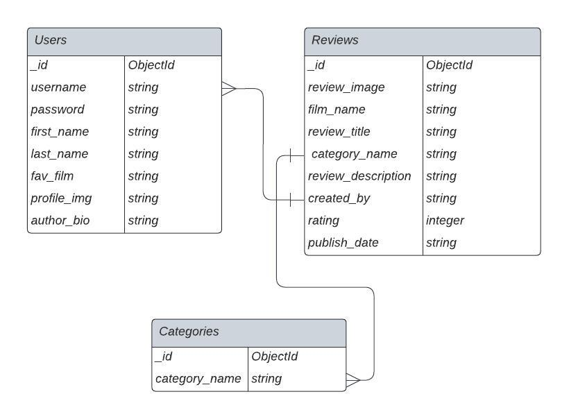

## MongoDB Database information
- One production database was created (binge_reviews) and it contains 3 collections
    1. users
    2. reviews
    3. categories
- A model.py file is included in the binge_reviews/models file to display the structure of the database in the python code. 
- The databases were created manually in MongoDB at first
- I then installed MongoDB connection directly into my IDE editor. This allowed me to check any data being added nto the database very quickly as opposed to logging into the mongodb website database each time. 

## Users

- The users collection is used to store user information when they register.
The fields stored when they register are.
    - Username(string) username
    - Password(string)  password
    - First Name(String) first_name
    - Last Name(string) last_name
    - Favorite Film(string) fav_film
    - Author Bio(string) author_bio
    - Profile Image(String) profile_img
- Password - The users password is encrypted using a generate_password_hash from the werkzeug.security Python library.

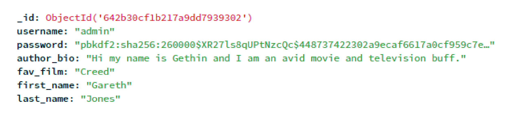

## Reviews

- The reviews is added by users of the website
- The fields stored in the collection are.
    - Review Image(string) review_image
    - Film Name(String) film_name
    - Review Title(string) review_title
    - Category Name(string) category_name
    - Review Description(string) review_description
    - Created by(string) created_by
    - Rating(Integer) rating
    - Publish Date(string) publish_date
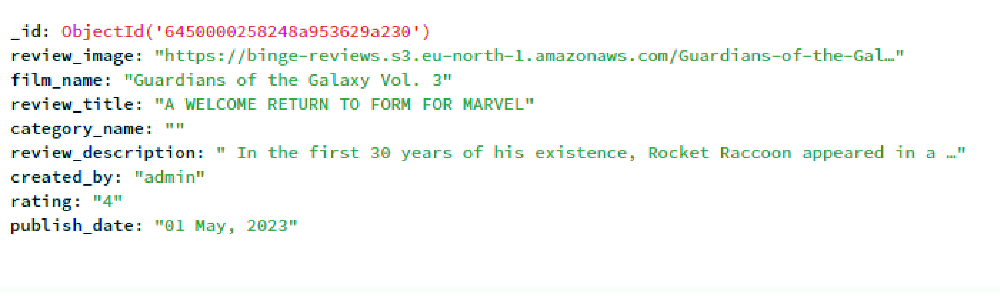

## Categories
- The category information is added by the admin user only, i chose this decision to stop users added different variations of the same genre.
- The fields stored are
    - Category Name(string) category_name
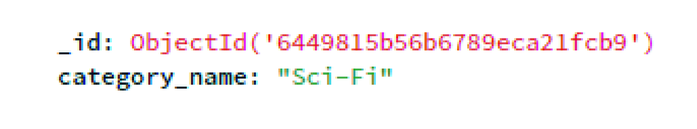

# Amazon Web Services S3 Bucket
I decided to use the Amazon S3 bucket to store the images urls for the imagery uploaded by the user. I found this video very helpful to implement this https://www.youtube.com/watch?v=tSfdQJvTKmk&t=528s

The steps I made to implement this 
1. Created a AWS account and created an S3 bucket called binge-reviews
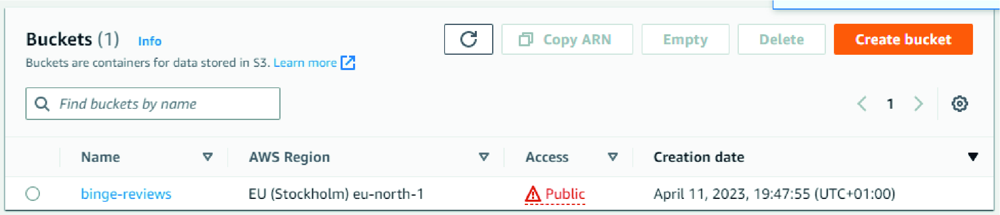
2. I created a user in AWS IAM, and gave the user the AmazonS3FullAccess permission
3. I then gave the bucket policy the necessary permissions to allow my application to access the S3 bucket
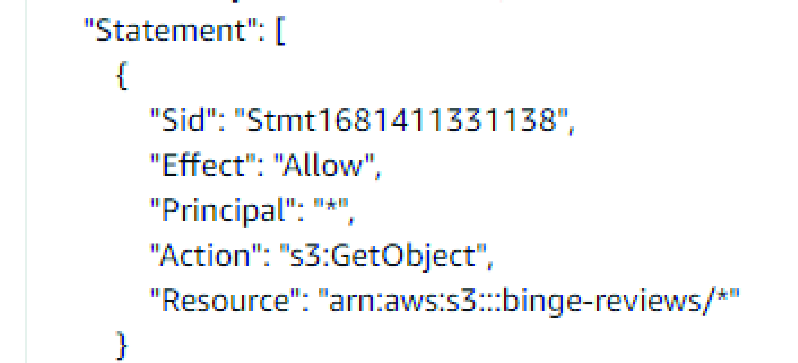
4. I imported the Boto3 python library (https://boto3.amazonaws.com/) in the util.py file I made a design decision to have an util.py in an util flask route python file that would be used to store code that could be used by multiple routes
5. I stored variables in the top of the util.py file <br>
<code>
s3_bucket_name = "binge-reviews"
s3_bucket_url = "https://binge-reviews.s3.eu-north-1.amazonaws.com/"
client = boto3.client('s3',
                      aws_access_key_id=os.environ.get("AWS_ACCESS_KEY_ID"),
                      aws_secret_access_key=os.environ.get(
                          "AWS_SECRET_ACCESS_KEY"))
</code>

6. A single function was written named upload_image that takes one parameter, the filename to store
7. This single function is used by the reviews, categories, authentication routes to store the images in the S3 bucket
8. This function stores a file in an AWS S3 bucket using boto3.
9. The boto3 put_object method is used to store the image taking two parameters, the file name and actual file <code> s3.Bucket(s3_bucket_name).put_object(Key=image_to_upload, Body=image)</code>
10. An image url is returned, and it is the image url that is stored in the mongodb for the relevant review, category or profile_img.
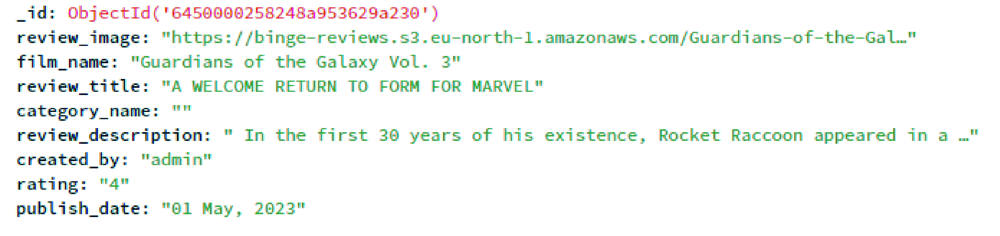

# Scope

## User stories for site user

- User Story 1.1: As a regular user the navigation bar is displayed with a logo on all pages for easy navigation, with a burger menu on mobile devices
- User Story 1.2: As a regular user the navigation item selected is highlighted
- User Story 1.3: As a regular user, when logged out, the home/landing page is the default page and there are three options with a logo, Home, Reviews, Login, Register displayed
- User Story 1.4: As a regular user, when logged in, the reviews page is the default page and there are six options with a logo: Home, Reviews, New Review, Log out, Profile
- User Story 2.1: As a regular user I can view the footers social icons(Twitter, facebook, instagram, pinterest, snapchat) and the relevant website opens in a new tab when clicked
- User Story 3.1: As a regular user I can view a hero image with latest reviews
- User Story 3.2: As a regular user I can view the latest reviews left by users
- User Story 3.3: As a regular user if I encounter an error with the application starting up I am navigated to a 404 error page
- User Story 3.4: As a regular user if I encounter an error with the application starting up I am navigated to a 500 error page
- User Story 3.5: As a regular user if I encounter an error when using the application(adding a review, category or registering), a message is displayed
- User Story 4.1: As a regular user I can register for an account by providing my username, password, first name, last name, favourite film and profile image, and I am redirected to the profile page.
- User Story 4.2: As a regular user my username must be a minimum of 5 characters, and a max of 25 characters.
- User Story 4.3: As a regular user my password must be a minimum of 8 characters.
- User Story 4.4: As a regular user I can log in to my account by providing my username and password and clicking Login and I will be navigated to the users profile page. A username and password must be provided. If the username and/or password entered is incorrectly a relevant message will be displayed
- User Story 4.5: As a regular user, when I am logged into the site, and I click Logout I am successfully logged out of the site, and brought to the home/reviews page, and the navigation bar is updated with three options with a logo, Home, Reviews, Login, Register
- User Story 5.1: Add Review - As a regular user I can add a Review by adding a Film Name, Upload a Review Image, add a Review Title, Select a category for the film, add the review decription content, and rate the film out of 5.
- User Story 5.2: Edit Review - As a regular user I can edit a review by uploading a review image, updating the fFilm name, updating the review title, Updating the selected category, Updating the review description, and editing the rating.
- User Story 5.3: Delete Review - As a regular user I can delete a review I created by confirming I want to delete
- User Story 5.4: View Review - As a regular user I can view a review by clicking on the 'Full review' button
- User Story 6.1: As a regular user I can view my profile page: Username, First Name, Last Name, Favourite Film, and Author Bio.
- User Story 6.2: As a regular user I can update my profile details: Username, Password, First Name, Last Name, Favourite Film 
- User Story 6.3: As a regular user I can delete my account. The user will be asked to confirm deletion of their profile. 
- User Story 7: Search - As a regular user I can search on text for the review name, film name. And the result will display those information

## User stories for site owner

The user stories overlap with regular users and admin users. The admin user does have rights to delete all reviews, add categories, delete categories. 

- User Story 1.1: As an admin user the navigation bar is displayed with a logo on all pages for easy navigation, with a burger menu on mobile devices
- User Story 1.2: As an admin user the navigation item selected is highlighted
- User Story 1.3: As an admin user, when logged out, the home/landing page is the default page and there are three options with a logo, Home, Reviews, Login, Register displayed
- User Story 1.4: As an admin user, when logged in, when logged in, the reviews page is the default page and there are six options with a logo: Home, Reviews, New Review, Log out, Profile
- User Story 2.1: As an admin user I can view the footers social icons(Twitter, facebook, instagram, pinterest, snapchat) and the relevant website opens in a new tab when clicked
- User Story 3.1: As an Admin user I can view a hero image with latest reviews
- User Story 3.2: As an Admin  user I can view the latest reviews left by users
- User Story 3.3: As an Admin user if I encounter an error with the application starting up I am navigated to a 404 error page
- User Story 3.4: As an Admin user if I encounter an error with the application starting up I am navigated to a 500 error page
- User Story 3.5: As an Admin user if I encounter an error when using the application(adding a review, category or registering), a message is displayed
- User Story 4.1: As an Admin user I can register for an account by providing my username, password, first name, last name, favourite film and profile image, and I am redirected to the profile page.
- User Story 4.2: As an Admin user my username must be a minimum of 5 characters, and a max of 25 characters.
- User Story 4.3: As an Admin user my password must be a minimum of 8 characters.
- User Story 4.4: As an Admin user I can log in to my account by providing my username and password and clicking Login and I will be navigated to the users profile page. A username and password must be provided. If the username and/or password entered is incorrectly a relevant message will be displayed
- User Story 4.5: As an Admin user, when I am logged into the site, and I click Logout I am successfully logged out of the site, and brought to the home/reviews page, and the navigation bar is updated with three options with a logo, Home, Reviews, Login, Register
- User Story 5.1: Add Review - As an Admin user I can add a Review by adding a Film Name, Upload a Review Image, add a Review Title, Select a category for the film, add the review description content, and rate the film out of 5.
- User Story 5.2: Edit Review - As an Admin user I can edit a review by uploading a review image, updating the fFilm name, updating the review title, Updating the selected category, Updating the review description, and editing the rating.
- User Story 5.3: Delete Review - As an Admin user I can delete a review I created by confirming I want to delete
- User Story 5.4: View Review - As an Admin user I can view a review by clicking on the 'Full review' button
- User Story 6.1: As a admin user I can view my profile page: Username, First Name, Last Name, Favourite Film, and Author Bio.
- User Story 6.2: As a admin user I can update my profile details: Username, Password, First Name, Last Name, Favourite Film 
- User Story 6.3: As a admin user I can delete my account. The user will be asked to confirm deletion of their profile. 
- User Story 7: Search - As a admin user I can search on text for the review name, film name. And the result will display those information
- User Story 8.1: As an Admin user I can delete reviews left by other users,
- User Story 8.2: As an Admin user I can delete categories I have created
- User Stories 8.3 As an Admin I can edit a category I have created

# Wireframes
## Desktop
<br>
<details><summary>Home</summary>

</details>
<br>
<details><summary>Profile</summary>

</details>
<br>
<details><summary>Register</summary>

</details>
<br>
<details><summary>Review</summary>

</details>
<br>

## Tablet 
<br>
<details><summary>Login</summary>

</details>
<br>
<details><summary>Profile</summary>

</details>
<br>
<details><summary>Register</summary>

</details>
<br>
<details><summary>Review</summary>

</details>
<br>

## Phone
<br>
<details><summary>Home</summary>

</details>
<br>
<details><summary>Login</summary>

</details>
<br>
<details><summary>Profile</summary>

</details>
<br>
<details><summary>Register</summary>

</details>
<br>

# Colours
The colours chosen were to keep the design simple with a dark theme.

- #F01D7F - Hot pink for the logo, primary buttons, and outlines for elements
<details><summary>#F01D7F Image</summary>

</details>
<br>
- #000 - Background for the main pages and also background of review cards
<br>
<details><summary>#F000 Image</summary>

</details>
<br>
- #28282B - This was used as the background colour of the secondary buttons.
<br>
<details><summary>#28282B Image</summary>

</details>
<br>
# Typography

Rubik was mainly used for the main headers of the website

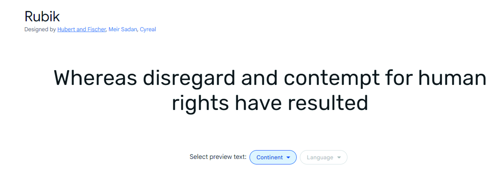

Poppins was used for the smaller headings and also the p and a tags

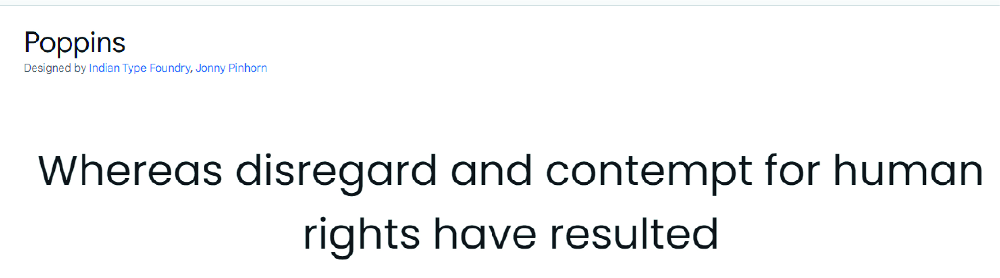
<br>

# Features

## Feature 1 Navigation Bar

Description feature 1

- The navigation bar us displayed on all pages. The nav bar was made using bootstrap 5.3 and is responsive on all device sizes. On Tablet and mobile devices it transforms into a hamburger menu.

- When the user is not logged in, there are 5 navigation elements. The logo, 'Home', 'Reviews', 'Login' and 'Register'

- When the user is logged in there are 6 navigation elements. The logo, 'Home', 'Reviews', 'New Review', 'Log out' and 'Profile page' The profile page uses a google icon 'User' instead of text.

- When the admin user is logged in there are 7 navigation elements. The logo, 'Home', 'Reviews', 'New Review', 'Categories', 'Log out' and 'Profile page' The profile page uses a google icon 'User' instead of text.

- Only logged in users can make a review.

- Logged out users, can still see the reviews.

- The logout button once clicked redirects the user to the 'Home/index' page

### Nav Bar Logged out Desktop

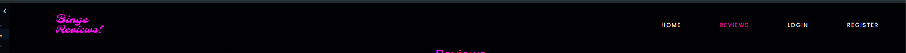

### Nav Bar Logged In Desktop

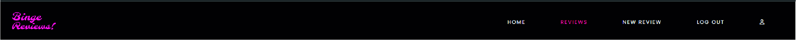

### Nav Bar logged In Admin User


### Nav Bar Logged out Tablet

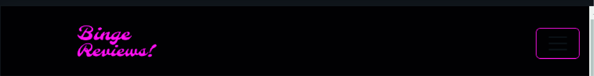

### Nav Bar Logged Out Tablet Expanded

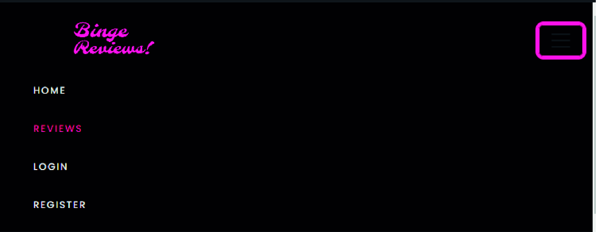

### Nav Bar logged In Expanded

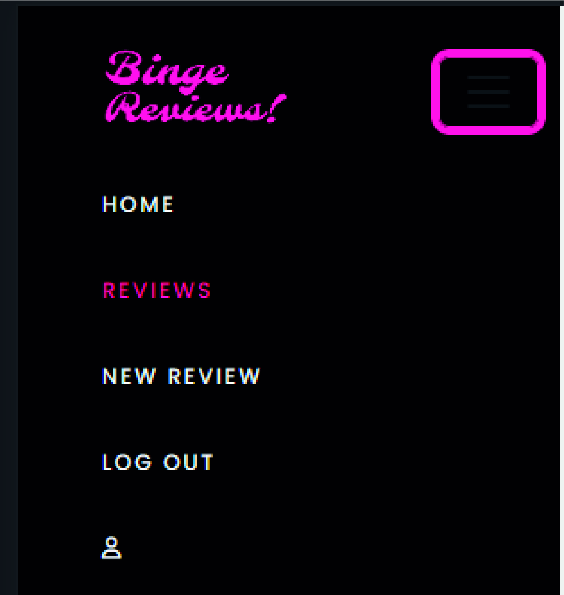

### Nav Bar Logged In Phone


### Nav Bar Logged Out Phone Expanded


### Nav Bar logged In Phone


### User Stories Feature 1

- User Story 1.1: As a regular user the navigation bar is displayed with a logo on all pages for easy navigation, with a burger menu on mobile devices
- User Story 1.2: As a regular user the navigation item selected is highlighted
- User Story 1.3: As a regular user, when logged out, the home/landing page is the default page and there are three options with a logo, Home, Reviews, Login, Register displayed
- User Story 1.4: As a regular user, when logged in, the reviews page is the default page and there are six options with a logo: Home, Reviews, New Review, Log out, Profile

## Feature 2 Footer

Description Feature 2

The footer is displayed on all pages of the website and has one section, I decided to only display one feature in the footer to keep the website clean and minimal.

1. Social Media Links

### Desktop Footer


### Tablet Footer


### Phone Footer
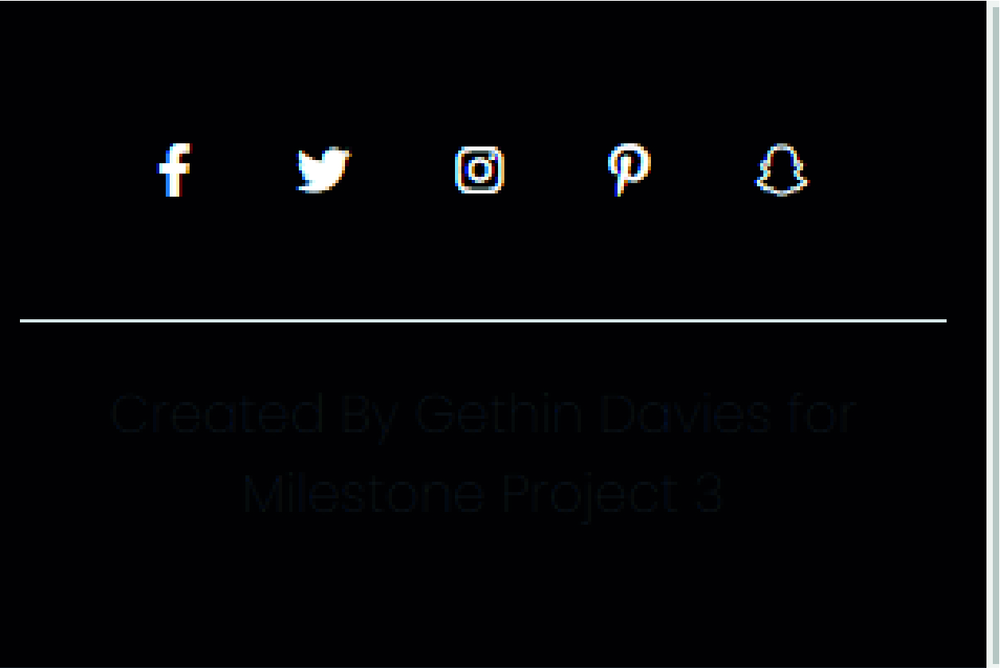

### User Stories Feature 2
- User Story 2.1: As an admin user I can view the footers social icons(Twitter, facebook, instagram, pinterest, snapchat) and the relevant website opens in a new tab when clicked

## Feature 3 Landing Page (Home)

### Description feature 3

The home page is displayed when the user accesses the website, on the homepage a 'Featured review'(hero image) is present, this is the latest review published using the jinja for loop function to loop through all the reviews, an 'If' statement is then nested to show. the latest published review. This keeps the homepage fresh an updated dynamically. <br>
<code><br>
        <br>
        <br>
        </code>


Below the featured review section the last 4 published reviews are displayed, this is dynamic and will update accordingly when new reviews are published.

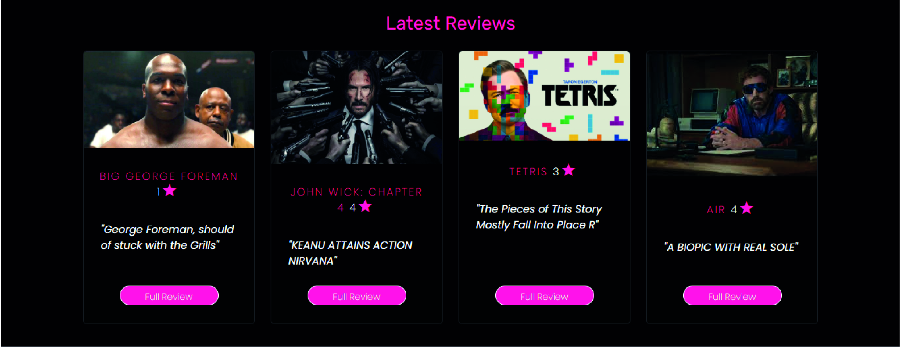


### User Stories Feature 3

- User Story 3.1: As a regular user I can view a hero image with latest reviews
- User Story 3.2: As a regular user I can view the latest reviews left by users
- User Story 2.1: As an admin user I can view the footers social icons(Twitter, facebook, instagram, pinterest, snapchat) and the relevant website opens in a new tab when clicked
- User Story 3.1: As an Admin user I can view a hero image with latest reviews
- User Story 3.2: As an Admin user I can view the latest reviews left by users

## Feature 4 Login/Register/Logout

### Description feature 4

- The User can register for an account by entering their Username, Password, First Name, Last Name, Favourite Film, Profile Image.
- All fields are required, and they will be notified with a flash message if the username already exists in the database. 
    <details><summary>Flash Message</summary>
    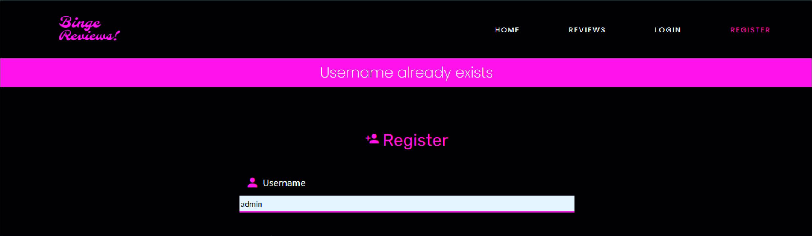
    </details>
    <br>


## Feature 5 Reviews/Add Reviews/Edit Reviews/Delete Reviews

### Description feature 5

## Feature 6 Profile Page

### Description feature 6

## Feature 7 Categories/Add Category/Edit Category/Delete Category

### Description feature 7

## Feature 8 Top and lowest rated reviews

### Description feature 8 

## Feature 9 Search

### Description feature  9

## Feature 10 Dashboard

### Description feature  10


<br>

# Features to implement

- I am happy with what I have implemented in the timeframe I had to produce this project, there is some future features I would like to add.

Number | Feature  
 ------------ | ------- |
1 | Social sharing of a memory on facebook, twitter  |
2 | Integrate the IMDB API, this is an api
3 | Include Music, Televsion sections
4 | Include the ability to like a review
5 | Leave comments on a review
6 | View the authors profile page

<br>

# Technologies Used 

## Languages 

- HTML
- CSS
- JavaScript
- Python
- Jinja

## Libraries

- Bootstrap 5
- Gitpod
- Github
- Google Fonts
- Font Awesome
- Lucidchart
- CSS Validation
- HMTL Validation
- Chrome Dev tools
- Am I Responsive
- Figma 
- Go FUll Page

# Testing
<br>
The testing information are documented in TESTING.md
<br>

# Deployment

## Amazon WebServices
1. Create an account at aws.amazon.com
2. Open the IAM application and create a new user
3. Set the AmazonS3FullAccess for the user and note the users AWS ACCESS and SECRET keys
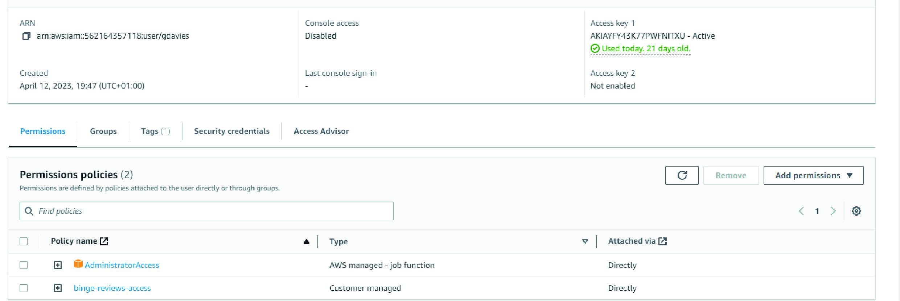
4. Open the S3 application and create a new bucket. For the purpose of this application the bucket name is binge-reviews
5. With security best practices update the public access and policy bucket to enable the user created and the application access to read/write to the S3 bucket. Consult the AWS documentation if required: https://aws.amazon.com/s3/

6. The s3 bucket is now updated to be accessed by your application
7. In the util.py route update the variables s3_bucket_name and s3_bucket_url with the correct information that you have set up, for example:
<br>
<code>s3_bucket_name = "binge-reviews"</code><br>
<code>s3_bucket_url = "https://binge-reviews.s3.eu-north-1.amazonaws.com/"</code>
<br>

## MongoDB

Mongodb is the database used in the application

1. Create an account at mongodb
2. Create a database cluster
3. Select the cluster, and in the collections section create a database and create 3 collections: users, reviews, categories
    <details><summary>MongoDB</summary>
    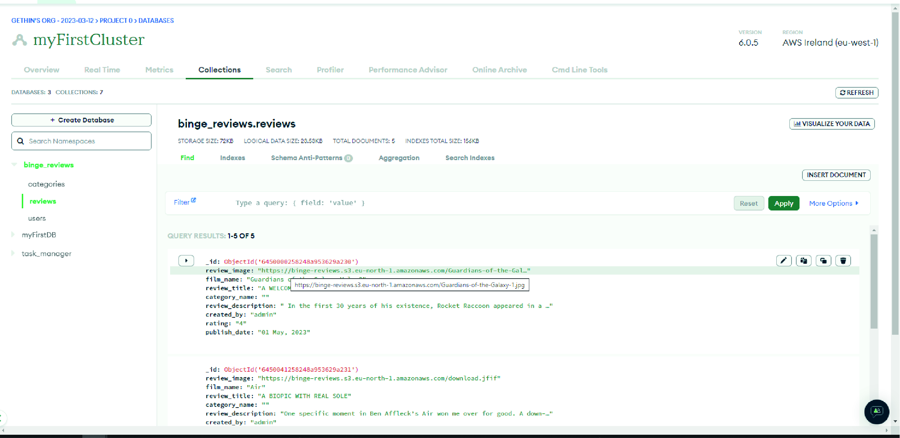
    </details>
    <br>
4. In the database access, create a user and allow the user read/write access. Note the username
5. In the network access tab, allow network access from the ip-address of the application connecting to the database
6. In the Databases section click Connect, and select connect your application
7. Note the MONGO_URI, MONGO_DBNAME and user, these parameters are used when deploying locally(env.py file) and deploying on the likes of heroku(config vars)
<br>

## Local Deployment
To run this project locally, you will need to clone the repository
1. Login to GitHub (https://wwww.github.com)
2. Select the repository GethinDavies1990/CI_MS3_DTR
3. Click the Code button and copy the HTTPS url, for example: https://github.com/GethinDavies1990/CI_MS3_DTR
4. In your IDE, open a terminal and run the git clone command, for example 

    ```git clone https://github.com/GethinDavies1990/CI_MS3_DTR.git```

5. The repository will now be cloned in your workspace
6. Create an env.py file in the root folder in your project, and add in the following code with the relevant key, value pairs, and ensure you enter the correct key values<br>
<code>import os</code><br>
<code>os.environ.setdefault("IP", TO BE ADDED BY USER)</code><br>
<code>os.environ.setdefault("PORT", TO BE ADDED BY USER)</code><br>
<code>os.environ.setdefault("SECRET_KEY", TO BE ADDED BY USER)</code><br>
<code>os.environ.setdefault("MONGO_URI", TO BE ADDED BY USER)</code><br>
<code>os.environ.setdefault("MONGO_DBNAME", TO BE ADDED BY USER)</code><br>
<code>os.environ.setdefault("AWS_ACCESS_KEY_ID", TO BE ADDED BY USER)</code><br>
<code>os.environ.setdefault("AWS_SECRET_ACCESS_KEY", TO BE ADDED BY USER)</code><br>
7. Install the relevant packages as per the requirements.txt file
8. Start the application by running <code>python3 app.py</code>

<br>

## Heroku
To deploy this application to Heroku, run the following steps.
1. In the app.py file, ensure that debug is not enabled, i.e. set to True
2. Create a file called ProcFile in the root directory, and add the line <code>web: python app.py</code> if the file does not already exist
3. Create a requirements.txt file by running the command <code>pip freeze > requirements.txt</code> in your terminal if the file doesn't already exist
5. Both the ProcFile and requirements.txt files should be added to your git repo in the root directory
6. Create an account on heroku.com
7. Create a new application and give it a unique name
8. In the application dashboard, navigate to the deploy section and connect your application to your git repo, by selecting your repo
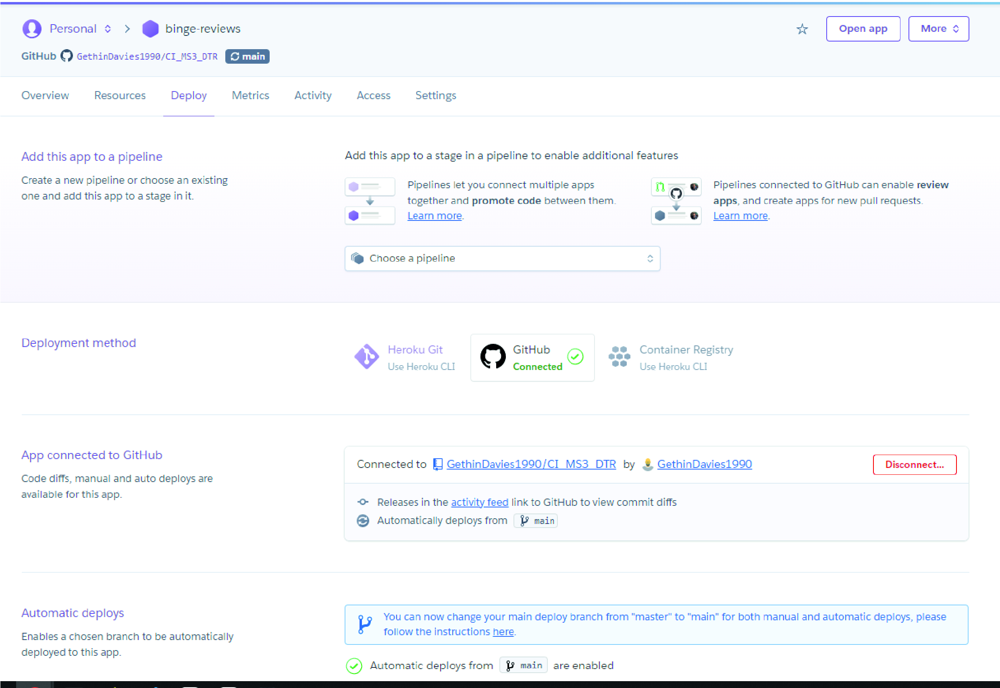
9. Select the branch for example master and enable automatic deploys if desired. Otherwise, a deployment will be manual
10. The next step is to set the config variables in the Settings section
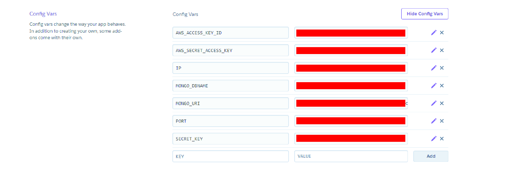
11. Set key/value pairs for the following keys: AWS_ACCESS_KEY_ID, AWS_SECRET_ACCESS_KEY, IP, MONGO_DBNAME, MONGO_URI, PORT, SECRET_KEY
12. Go to the dashboard and trigger a deployment
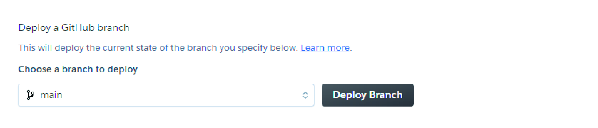
13. This will trigger a deployment, once the deployment has been successful click on the "Open App" link to open the app
14. If you encounter any issues accessing the build logs is a good way to troubleshoot the issue

<br>

# Credits

- For the website I used IMDB for motivation, https://www.imdb.com/
- I found this quick course very helpful in using the blueprint structure, and the flask application in general. https://www.udemy.com/course/python-and-flask-bootcamp-create-websites-using-flask/learn/lecture/11084628?start=600#content
- For setting up aws s3 I found this video helpful
    -https://www.youtube.com/watch?v=f3j5EdjsKww
    -https://www.youtube.com/watch?v=4hnxrgTbmxw
- For string the images in a bucket these videos helped
    - https://www.youtube.com/watch?v=4hnxrgTbmxw
    - https://www.youtube.com/watch?v=tSfdQJvTKmk&t=528s
- Getting to grips with flask, i found this channel extremely helpful
    -https://www.youtube.com/playlist?list=PLCC34OHNcOtolz2Vd9ZSeSXWc8Bq23yEz

<br>

# Content and Media

- Images, the images used on the website were mainly from google images.
- Google fonts, was used for the typography, 'Rubik' and 'Poppins' were the fonts installed
- Logo, The logo was created by myself in Adobe Ilustrator
- The reviews generated for testing purposes were from Empire Reviews - https://www.empireonline.com/movies/reviews/

<br>

# Acknowledgements

- I would like to thank my wife for always being patient with me and supporting me on the duration of this project. And my Son for always being my driving force of motivation.

- I would also like to thank my mentor Mo Shami, for always pushing me to put out my best effort and work. 

