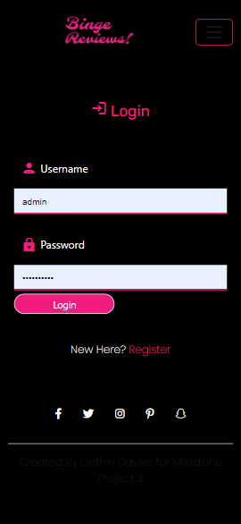
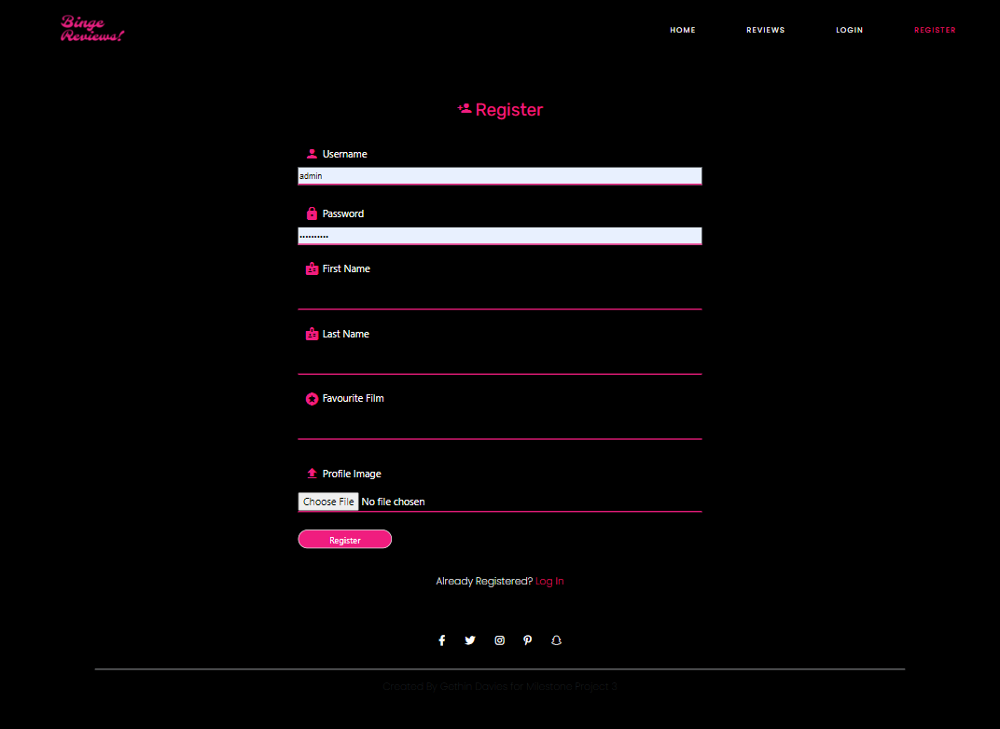
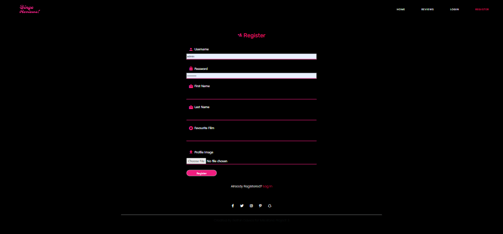
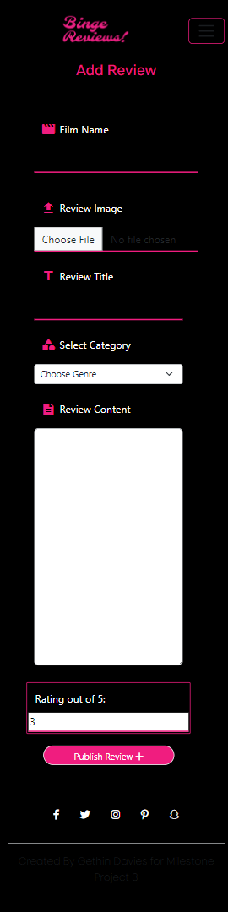

# Testing 

The testing performed in this unit is described in this testing readme: 
1. Manual testing using emulators and real devices. 

 

## Unit Testing

To follow

## Automated testing

To follow

Device Number | Physical/Emulator | Device Name | Device Type | Browser |
------------ | ------------ | ------------- | ------------- | ------------- |
1 | Physical | Galaxy Note 3 | Phone |  Chrome | 
2 | Physical | iPhone 8 | Mobile |Safari | 
3 | Physical | Iphone 14 Pro | Mobile | Safari | 
4 | Physical | Lenovo | Desktop | IE Edge | 
5 | Physical | Macbook Pro 14 | Desktop | Mozilla Firefox |
6 | Physical | Imac | Desktop | Chrome | 
7 | Emulator | Ipad Air | Tablet | Chrome | 
8 | Emulator | Surface Pro 2 | Tablet | Chrome | 
9 | Emulator | Pixel 2 | Tablet | Chrome | 

## Responsiveness Testing

I made a very thorough check on responsiveness on all devices on the the google chrome emulator, and also on the physical devices I own personally which are stated in the table above.  Screen shots are included off all these devices below for each page.

### Homepage

Blackberry playbook - home

 

Blackberry Z30 - Home

 

Desktop 1000px - Home

 

Desktop 1600px - Home

 

Desktop 2500px - Home

 

Galaxy 8 - Home<

 

Galaxy Fold - Home

 

Galaxy Net Hub - Home

 

Galaxy note 3 - Home

 

Galaxy S5 - Home

 

Galaxy S9 plus - Home

 

Ipad Air - Home

 

Ipad Mini - Home

 

Ipad Pro - Home

 

Iphone4 - Home

 

Iphone SE - Home

 

Iphone XR - Home

 

Pixel3 XL - Home

 

Samsung Galaxy S20 Ultra - Home

 

Samsung Pro Duo - Home

 

Samsung Pro 7 - Home

 

###  Form Pages Login/Register/Add Review/Edit Review

Surface Pro 7 - form

 

Blackberry Playbook - form 

 

Blackberry Z30 - form 

 

Desktop 1600px - form 

 

Desktop 1000px - form 

 

Desktop 2500px - form 

 

Galaxy 8 - form 

 

Galaxy Note 3 - form 

 

Nest- Form

 

