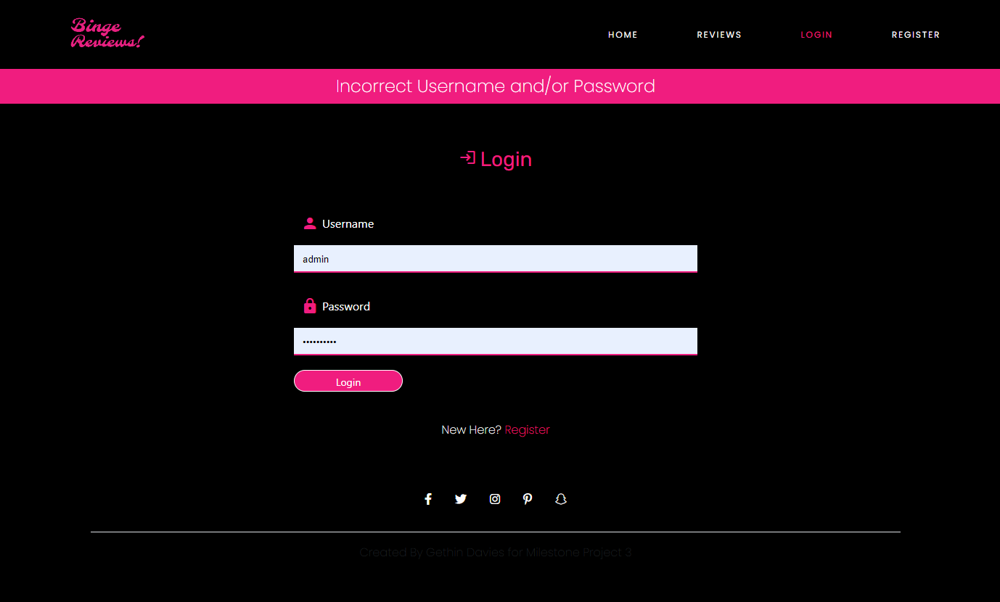
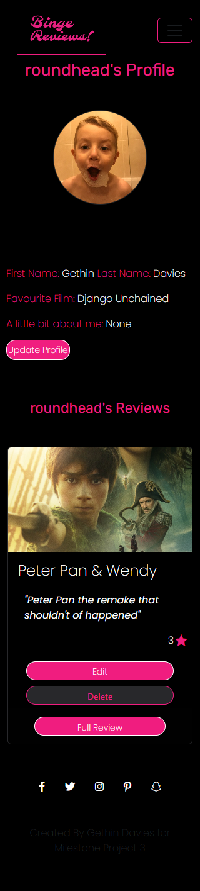

# Testing

The testing performed in this unit is described in this testing readme:
1. Manual testing using emulators and real devices.

 

## Unit Testing

The unit testing was performed in the tests/ directory, each file tests function related to their respective routes. this is detailed below. I would of liked to of tested my whole app but due to time constraints, I couldn't do so. see below detailed report of the tests performed.

I tested using pytest, and Mongomock to create a mock database.

### test_authentication

This file includes the test functions for the authentication section of the application.

- test_register: Test's the functions ability to register a user to the database.

### test_categories

This file includes the test functions for the Category functions

- test_add_category: Test's to see if a category collection is added to the database.
- test_update_category: Test's an added collection already in the database and updates the collection.

### test_reviews

This file includes the test functions for the review functions

- test_add_review: Test's to see if a review collection is added to the database.
- test_update_review: Test's an added collection already in the database and updates the collection.

### test_routes

This file includes the test function for the route's
I only managed to test 1 route, I would of liked to tested all, but I was having issues making more than one call with the client app.

- test_routes: Tests the routes and a response is parsed.

### test_util
This file includes the test functions for the util.py

- test_get_timestamp was ran to check the function on generate_timestamp

Device Number | Physical/Emulator | Device Name | Device Type | Browser |
------------ | ------------ | ------------- | ------------- | ------------- |
1 | Physical | Galaxy Note 3 | Phone |  Chrome |
2 | Physical | iPhone 8 | Mobile |Safari |
3 | Physical | Iphone 14 Pro | Mobile | Safari |
4 | Physical | Lenovo | Desktop | IE Edge |
5 | Physical | Macbook Pro 14 | Desktop | Mozilla Firefox |
6 | Physical | Imac | Desktop | Chrome |
7 | Emulator | Ipad Air | Tablet | Chrome |
8 | Emulator | Surface Pro 2 | Tablet | Chrome |
9 | Emulator | Pixel 2 | Tablet | Chrome |

## Responsiveness Testing

I made a very thorough check on responsiveness on all devices on the the google chrome emulator, and also on the physical devices I own personally which are stated in the table above.  Screen shots are included off all these devices below for each page.

### Homepage

Blackberry playbook - home

 

Blackberry Z30 - Home

 

Desktop 1000px - Home

 

Desktop 1600px - Home

 

Desktop 2500px - Home

 

Galaxy 8 - Home<

 

Galaxy Fold - Home

 

Galaxy Net Hub - Home

 

Galaxy note 3 - Home

 

Galaxy S5 - Home

 

Galaxy S9 plus - Home

 

Ipad Air - Home

 

Ipad Mini - Home

 

Ipad Pro - Home

 

Iphone4 - Home

 

Iphone SE - Home

 

Iphone XR - Home

 

Pixel3 XL - Home

 

Samsung Galaxy S20 Ultra - Home

 

Samsung Pro Duo - Home

 

Samsung Pro 7 - Home

 

###  Form Pages Login/Register/Add Review/Edit Review

Blackberry Playbook - form 

 

Blackberry Z30 - form 

 

Desktop 1600px - form 

 

Desktop 1000px - form 

 

Desktop 2500px - form 

 

Galaxy 8 - form 

 

Galaxy Note 3 - form 

 

Nest- Form

 

## Feature 1 Navigation Bar

### User Story 1.1

- User Story 1.1: As a admin/regular user the navigation bar is displayed with a logo on all pages for easy navigation, with a burger menu on mobile devices

### Test case steps 1.1

1. navigate to home/index page

### Expected Result 1.1

1. The home/index page will be displayed with logo and navigation bar, with a burger menu on mobile devices

### Actual Result 1.1

Step Number | Desktop | Tablet | Mobile
------------ | ------------ | ------------- | ------------- |
Step 1 | Pass  | Pass |Pass

Desktop Result

 

Mobile Result

 

Tablet Result

 

### User Story 1.2

- User Story 1.2: As a regular/admin user the navigation item selected is highlighted

### Test case steps 1.2

1. navigate to home/index page and locate navbar

### Expected Result 1.2

1. The active page is highlighted to notify the user this is the page they are on.

### Actual Result 1.2

Step Number | Desktop | Tablet | Mobile
------------ | ------------ | ------------- | ------------- |
Step 1 | Pass  | Pass |Pass

Desktop Result

 

Mobile Result

 

Tablet Result

 

### User Story 1.3

- User Story 1.3: As a regular/admin user, when logged out, the home/landing page is the default page and there are three options with a logo, Home, Reviews, Login, Register displayed

### Test case steps 1.3

1. navigate to home/index page and locate navbar

### Expected Result 1.3

1. The 3 links and logos are visible on all devices

### Actual Result 1.3

Step Number | Desktop | Tablet | Mobile
------------ | ------------ | ------------- | ------------- |
Step 1 | Pass  | Pass |Pass

Desktop Result

 

Mobile Result

 

Tablet Result

 

### User Story 1.4

- User Story 1.4: As a regular user, when logged in, the reviews page is the default page and there are six options with a logo: Home, Reviews, New Review, Log out, Profile

### Test case steps 1.4

1. navigate to home/index page and locate navbar

### Expected Result 1.4

1. The 5 links and logos are visible on all devices

### Actual Result 1.4

Step Number | Desktop | Tablet | Mobile
------------ | ------------ | ------------- | ------------- |
Step 1 | Pass  | Pass |Pass

Desktop Result

 

Mobile Result

 

Tablet Result

 

## Feature 2 Footer

### User Story 2.1

- User Story 2.1: As a regular/admin user if i navigate to the footer of the website, and click all social media links they open within new tabs.

### Test case steps 2.1

1. navigate to home/index page and locate footer at bottom of page
2. click links to open social media pages.

### Expected Result 2.1

1. All links open in a new tab, and are complete (no broken links)

### Actual Result 2.1

Step Number | Desktop
------------ | ------------
Step 1 | Pass

Desktop Result

 

## Feature 3 Landing Page

### User Story 3.1

- User Story 3.1: As a regular/admin user I can view a hero image

### Test case steps 3.1

1. navigate to home/index page

### Expected Result 3.1

1. The home/index page will display the hero image on all devices

### Actual Result 3.1

Step Number | Desktop | Tablet | Mobile
------------ | ------------ | ------------- | ------------- |
Step 1 | Pass  | Pass |Pass

Desktop Result

 

Mobile Result

 

Tablet Result

 

### User Story 3.2

- User Story 3.2: As a regular/admin user I can view the latest reviews left by users

### Test case steps 3.2

1. navigate to home/index page and locate the latest reviews section

### Expected Result 3.2

1. The latest reviews are on display under the hero image on the homepage.

### Actual Result 3.2

Step Number | Desktop | Tablet | Mobile
------------ | ------------ | ------------- | ------------- |
Step 1 | Pass  | Pass |Pass

Desktop Result

 

Mobile Result

 

Tablet Result

 

### User Story 3.3

- User Story 3.3: As a regular/admin user if I encounter an error with the application starting up I am navigated to a 404 error page

### Test case steps 3.3

1. Enter a URL that doesn't exist, for example - https://binge-reviews.herokuapp.com/hello

### Expected Result 3.3

1. The error 404 page is displayed and a link to the homepage is displayed on the page.

### Actual Result 3.3

Step Number | Desktop | Tablet | Mobile
------------ | ------------ | ------------- | ------------- |
Step 1 | Pass  | Pass |Pass

Desktop Result

 

Mobile Result

 

Tablet Result

 

### User Story 3.4

- User Story 3.4: As a regular/admin user if I encounter an error with the application starting up I am navigated to a 500 error page

### Test case steps 3.4

1. In your local environment in the env.py file modify the MONGO_URI to set an incorrect Password
2. Start the application, for example python3 app.py

### Expected Result 3.4

1. The MONGO_URI entry is updated
2. The application starts and the user is navigated to a 500 error page

### Actual Result 3.4

Step Number | Desktop | Tablet | Mobile
------------ | ------------ | ------------- | ------------- |
Step 1 | Pass  | Pass |Pass

Desktop Result

 

Mobile Result

 

Tablet Result

 

### User Story 3.5

-User Story 3.5: As a regular/admin user if I encounter an error when using the application(adding a review, category or registering), a message is displayed

### Test case steps 3.5

1. In your local environment in the env.py file modify the AWS_SECRET_ACCESS_KEY to set an incorrect key
2. Start the application, for example python3 app.py
3. As a regular user add a review

### Expected Result 3.5

1. The change is made
2. The application starts
3. The review does not add an exception is displayed: "An exception occurred when adding a new review: Exception('Exception when uploading the image to AWS S3 bucket')"

### Actual Result 3.5

Step Number | Desktop | Tablet | Mobile
------------ | ------------ | ------------- | ------------- |
Step 1 | n/a  | n/a  | n/a
Step 2 | n/a   | n/a  | n/a
Step 3 | Pass  | Pass |Pass

Desktop Result

 

Mobile Result

 

Tablet Result

 

## Feature 4 Login/Register/logout

### User Story 4.1

-User Story 4.1: As a regular/admin user I can register for an account by providing my username, password, first name, last name, favourite film and profile image, and I am redirected to the profile page.

### Test case steps 4.1
1. Navigate to the Register page, input your details, and select register
2. If successful they will be redirect to their profile page

### Expected Result 4.1
1. Navigated to the register page, and was given the option to input my details
2. inputting my details and registering, redirects me to my profile page.

### Actual Result 4.1

Step Number | Desktop | Tablet | Mobile
------------ | ------------ | ------------- | ------------- |
Step 1 | Pass  | Pass |Pass
Step 2 | Pass  | Pass |Pass

Step 1 - Desktop Result

 

Step 1 - Mobile Result

 

Step 1 - Tablet Result

 

Step 2 - Desktop Result

 

Step 2 - Mobile Result

 

Step 2 - Tablet Result

 

### User Story 4.2

-User Story 4.2: As a regular/admin user my username must be a minimum of 5 characters, and certain input's must be completed.

### Test case steps 4.2

1. Navigate to Register/Login page, register or login without completing input's

### Expected Result 4.2

1. Navigated to the register page, and tried submitting form with less than 5 characters, validation was fed back to me.

### Actual Result 4.2

Step Number | Desktop | Tablet | Mobile
------------ | ------------ | ------------- | ------------- |
Step 1 | Pass  | Pass |Pass

Desktop Result

 

Mobile Result

 

Tablet Result

 

### User Story 4.3

-User Story 4.3: As a regular/admin user my password must be a minimum of 8 characters.

### Test case steps 4.3

1. Navigate to Register/Login page, register or login without completing input's

### Expected Result 4.3

1. Navigated to the register page, and tried submitting form with less than 8 characters, validation was fed back to me.

### Actual Result 4.3

Step Number | Desktop | Tablet | Mobile
------------ | ------------ | ------------- | ------------- |
Step 1 | Pass  | Pass |Pass

Desktop Result

 

Mobile Result

 

Tablet Result

 

### User Story 4.4

-User Story 4.4: As a regular user I can log in to my account by providing my username and password and clicking Login and I will be navigated to the users profile page. A username and password must be provided. If the username and/or password entered is incorrectly a relevant message will be displayed

### Test case steps 4.4

1. As a regular user/admin user navigate to the login page and click the Login button
2. Enter a username and/or password that does not exist
3. Enter a valid username and password

### Expected Result 4.4

1. An error message is displayed that both the username and password fields must be entered
2. A message is displayed: Incorrect Username and/or Password
3. The user is successfully logged in and is brought to their profile page

### Actual Result 4.4

Step Number | Desktop | Tablet | Mobile
------------ | ------------ | ------------- | ------------- |
Step 1 | n/a  | n/a | n/a
Step 2 | Pass  | Pass |Pass
Step 3 | Pass  | Pass |Pass

Step 2 - Desktop Result

 

Step 2 - Mobile Result

 

Step 2 - Tablet Result

 

Step 3 - Desktop Result

 

Step 3 - Mobile Result

 

Step 3 - Tablet Result

 

### User Story 4.5

- User Story 4.5: As a regular/admin user, when I am logged into the site, and I click Logout I am successfully logged out of the site, and brought to the home page, and the navigation bar is updated with three options with a logo, Home, Reviews, Login, Register

### Test case steps 4.5

1. As a regular user/admin user navigate to the logout button and click

### Expected Result 4.5

1. The user is logged out and redirected back to the

### Actual Result 4.5

Step Number | Desktop | Tablet | Mobile
------------ | ------------ | ------------- | ------------- |
Step 1 | Pass  | Pass | Pass

Desktop Result

 

Mobile Result

 

Tablet Result

 

## Feature 5 Add/Edit/Delete Review

### User Story 5.1

- User Story 5.1: Add Review - As a regular/admin user I can add a Review by adding a Film Name, Upload a Review Image, add a Review Title, Select a category for the film, add the review description content, and rate the film out of 5.

### Test case steps 5.1

1. Once Logged in, navigate to the Navigation bar and click 'New Review'
2. fill in the required information -  Film Name, Review Image, Review Title, category, review description, and rate the film out of 5 and select 'Publish Review'
3. If successful, a flash Message will display, and the user is navigated to the 'Reviews' page where the users review is published.

### Expected Result 5.1

1. After clicking the 'New Review' link I am linked to the 'New Review' url
2. After filling in all fields I can click 'Publish Review'
3. Review is published, and the user is displayed with a feedback flash message of their successful review publish

### Actual Result 5.1

Step Number | Desktop | Tablet | Mobile
------------ | ------------ | ------------- | ------------- |
Step 1 | Pass  | Pass | Pass
Step 2 | Pass  | Pass | Pass
Step 3 | Pass  | Pass | Pass

Step 1 - Result

 

Step 2 - Desktop Result

 

Step 2 - Mobile Result

 

Step 2 - Tablet Result

 

Step 3 - Desktop Result

 

Step 3 - Mobile Result

 

Step 3 - Tablet Result

 

### User Story 5.2

- User Story 5.2: Edit Review - As a regular/admin user I can edit a review by uploading a review image, updating the Film name, updating the review title, Updating the selected category, Updating the review description, and editing the rating.

### Test case steps 5.2

1. Once Logged in, navigate to profile page
2. locate the review to edit/update
3. Update the required information

### Expected Result 5.2

1. Navigated to profile and all reviews I have published are visible, select review to edit.
2. Update information and click 'Edit Review'
3. If successful, the user is prompted with a flash message to say their update was successful.

### Actual Result 5.2

Step Number | Desktop | Tablet | Mobile
------------ | ------------ | ------------- | ------------- |
Step 1 | Pass  | Pass | Pass
Step 2 | Pass  | Pass | Pass
Step 3 | Pass  | Pass | Pass

Step 1 - Desktop Result

 

Step 1 - Mobile Result

 

Step 1 - Tablet Result

 

Step 2 - Desktop Result

 

Step 2 - Mobile Result

 

Step 2 - Tablet Result

 

Step 3 - Desktop Result

 

Step 3 - Mobile Result

 

Step 3 - Tablet Result

 

### User Story 5.3

- User Story 5.3: Delete Review - As a regular/admin user I can delete a review I created by confirming I want to delete

### Test case steps 5.3

1. Once logged in, navigate to profile and select a review you wish to delete
2. locate the review and click 'Delete Review'
3. The user is prompted with a modal, to confirm deletion
4. Once deleted a flash message displays to confirm the review has been deleted.

### Expected Result 5.3

1. Navigated to profile and all reviews I have published are visible, select review to delete.
2. Click Delete Review
3. I am presented with a modal to confirm deletion, clicked confirm deletion
4. review is deleted and i am prompted with a flash message to notify me of this.

### Actual Result 5.3

Step Number | Desktop | Tablet | Mobile
------------ | ------------ | ------------- | ------------- |
Step 1 | n/a  | n/a | n/a
Step 2 | n/a  | n/a | n/a
Step 3 | Pass  | Pass | Pass
Step 4 | Pass  | Pass | Pass

Step 3 - Desktop Result

 

Step 3 - Mobile Result

 

Step 3 - Tablet Result

 

Step 4 - Desktop Result

 

Step 4 - Mobile Result

 

Step 4 - Tablet Result

 

### User Story 5.4

- User Story 5.4: View Review - As a regular/admin user I can view a review by clicking on the 'Full review' button

### Test case steps 5.4

1. Click 'Full Review'

### Expected Result 5.4

1. After clicking 'Full Review' I am presented with the page of the review

### Actual Result 5.4

Step Number | Desktop | Tablet | Mobile
------------ | ------------ | ------------- | ------------- |
Step 1 | Pass  | Pass | Pass

Desktop Result

 

Mobile Result

 

Tablet Result

 

# Feature 6 Profile Page

### User Story 6.1

User Story 6.1: As a regular user I can view my profile page: Username, First Name, Last Name, Favourite Film, and Author Bio.

### Test case steps 6.1

1. Navigate to profile page by clicking 'User' icon in the navigation bar

### Expected Result 6.1

1. Profile page is displayed

### Actual Result 6.1

Step Number | Desktop | Tablet | Mobile
------------ | ------------ | ------------- | ------------- |
Step 1 | Pass  | Pass | Pass

Desktop Result

 

Mobile Result

 

Tablet Result

 

### User Story 6.2

User Story 6.2: As a regular/admin user I can update my profile details: Username, Password, First Name, Last Name, Favourite Film

### Test case steps 6.2

1. on profile page click 'Update profile' button
2. updating information will be confirmed with a flash message.

### Expected Result 6.2

1. On profile page selecting 'Update profile' button will redirect to url
2. updating information and clicking 'Update' will be confirmed and I am notified with a flash message.

### Actual Result 6.2

Step Number | Desktop | Tablet | Mobile
------------ | ------------ | ------------- | ------------- |
Step 1 | Pass  | Pass | Pass
Step 2 | Pass  | Pass | Pass

Step-1 Desktop Result

 

Step-1 Mobile Result

 

Step-1 Tablet Result

 

Step-2 Desktop Result

 

Step-2 Mobile Result

 

Step-2 Tablet Result

 

### User Story 6.3

User Story 6.3: As a regular/admin user I can delete my account. The user will be asked to confirm deletion of their profile.

### Test case steps 6.3

1. On profile page click 'Update/Delete profile' button will direct the user to the update/delete page. On clicking delete the user will be displayed with a modal to confirm deletion.
2. click delete to remove the profile

### Expected Result 6.3

1. clicking delete profile displays a modal to confirm deletion
2. clicking delete will delete the profile

### Actual Result 6.3

Step Number | Desktop | Tablet | Mobile
------------ | ------------ | ------------- | ------------- |
Step 1 | n/a  | n/a | n/a
Step 2 | Pass  | Pass | Pass

Step-1 Desktop Result

 

Step-1 Mobile Result

 

Step-1 Tablet Result

 

# Feature 7 - Search

### User Story 7.1

User Story 7: Search - As a regular user I can search on text for the review name, film name. And the result will display those information

### Test case steps 7.1

1. Navigate to the Reviews Page, and locate the search bar in the middle of the page, search a film.

### Expected Result 7.1

1. Searching for a film in the database, returns a match. the search only works for films in the database.

### Actual Result 7.1

Step Number | Desktop | Tablet | Mobile
------------ | ------------ | ------------- | ------------- |
Step 1 | Pass  | Pass | Pass

Step-1 Desktop Result

 

Step-1 Mobile Result

 

Step-1 Tablet Result

 

# Feature 8 - Admin control

### User Story 8.1

User Story 8.1: As an Admin user I can delete reviews left by other users,

### Test case steps 8.1

1. Once logged in as an admin, locate a review and click the 'delete review' button, the user will be directed to the edit/delete review page.
2. The user will be prompted with a modal to confirm deletion, click delete to delete review

### Expected Result 8.1

1. located review and clicked 'Delete review', directed to edit/delete page.
2. clicking delete will delete the review from the database

### Actual Result 8.1

Step Number | Desktop | Tablet | Mobile
------------ | ------------ | ------------- | ------------- |
Step 1 | n/a  | n/a | n/a
Step 2 | Pass  | Pass | Pass

Desktop Result

 

Mobile Result

 

Tablet Result

 

### User Story 8.2

 User Story 8.2: As an Admin user I can delete and edit categories

### Test case steps 8.2

1. Once logged in as an admin, navigate to the categories page, and select edit or delete.
2. a modal will be displayed to confirm deletion.

### Expected Result 8.2

1. located the category page and selected delete/edit
2. A modal appears to confirm deletion

### Actual Result 8.2

Step Number | Desktop | Tablet | Mobile
------------ | ------------ | ------------- | ------------- |
Step 1 | Pass  | Pass | Pass
Step 1 | Pass  | Pass | Pass

Step 1 - Desktop Result

 

Step 1 - Mobile Result

 

Step 1 - Tablet Result

 

Step 2 - Desktop Result

 

Step 2 - Mobile Result

 

Step 2 - Tablet Result

 

# Code Validation

## HTML Validation

Page | Result | Test Detail/Screenshot
------------ | ------------- | -------------
home.html | Passed, No errors found | [Results](binge_reviews/static/images/readme/testing/html_validation/home_html.png)
add_category.html | Passed, No errors found | [Results](binge_reviews/static/images/readme/testing/html_validation/add_category_html.png)
add_review.html | Passed, No errors found | [Results](binge_reviews/static/images/readme/testing/html_validation/add_review_html.png)
categories.html | Passed, No errors found | [Results](binge_reviews/static/images/readme/testing/html_validation/categories_html.png)
edit_category.html | Passed, No errors found | [Results](binge_reviews/static/images/readme/testing/html_validation/edit_category_html.png)
edit_review.html | Passed, No errors found | [Results](binge_reviews/static/images/readme/testing/html_validation/edit_review_html.png)
login.html | Passed, No errors found | [Results](binge_reviews/static/images/readme/testing/html_validation/login_html.png)
profile.html | Passed, No errors found | [Results](binge_reviews/static/images/readme/testing/html_validation/profile_html.png)
register.html | Passed, No errors found | [Results](binge_reviews/static/images/readme/testing/html_validation/register_html.png)
review.html | Passed, No errors found | [Results](binge_reviews/static/images/readme/testing/html_validation/review_html.png)
reviews.html | Passed, No errors found | [Results](binge_reviews/static/images/readme/testing/html_validation/reviews_html.png)

 

## CSS Validation

Page | Result | Test Detail/Screenshot
------------ | ------------- | -------------
style.css | Passed, No errors found | [Results](binge_reviews/static/images/readme/testing/css_validation/css_validation.png)

 

## Python Code Validation

Page | Result | Test Detail/Screenshot
------------ | ------------- | -------------
binge_reviews/categories/routes.py | No Errors/Warnings | [Results](binge_reviews/static/images/readme/testing/python_validation/categories.png)
binge_reviews/__init | No Errors/Warnings | [Results](binge_reviews/static/images/readme/testing/python_validation/__init__.png)
binge_reviews/app| No Errors/Warnings | [Results](binge_reviews/static/images/readme/testing/python_validation/app.png)
binge_reviews/authentication/routes.py | No Errors/Warnings | [Results](binge_reviews/static/images/readme/testing/python_validation/authentication.png)
binge_reviews/errors/routes.py | No Errors/Warnings | [Results](binge_reviews/static/images/readme/testing/python_validation/errors.png)
binge_reviews/models.py | No Errors/Warnings | [Results](binge_reviews/static/images/readme/testing/python_validation/models.png)
binge_reviews/reviews/routes.py | No Errors/Warnings | [Results](binge_reviews/static/images/readme/testing/python_validation/reviews.png)
binge_reviews/util.py | No Errors/Warnings | [Results](binge_reviews/static/images/readme/testing/python_validation/util.png)
 

## JavaScript Code Validation

 

## Wave Accessibility

Page | Result | Test Detail/Screenshot
------------ | ------------- | -------------
add_category.html | Passed, No errors found | [Results](binge_reviews/static/images/readme/testing/wave/add_category_wave.png)
add_review.html | Passed, No errors found | [Results](binge_reviews/static/images/readme/testing/wave/add_review_wave.png)
categories.html | Passed, No errors found | [Results](binge_reviews/static/images/readme/testing/wave/categories_wave.png)
edit_category.html | Passed, No errors found | [Results](binge_reviews/static/images/readme/testing/wave/edit_category_wave.png)
edit_review.html | Passed, No errors found | [Results](binge_reviews/static/images/readme/testing/wave/edit_review_wave.png)
errors.html | Passed, No errors found | [Results](binge_reviews/static/images/readme/testing/wave/error_wave.png)
home.html | Passed, No errors found | [Results](binge_reviews/static/images/readme/testing/wave/home_wave.png)
login.html | Passed, No errors found | [Results](binge_reviews/static/images/readme/testing/wave/login_wave.png)
register.html | Passed, No errors found | [Results](binge_reviews/static/images/readme/testing/wave/register_wave.png)
review.html | Passed, No errors found | [Results](binge_reviews/static/images/readme/testing/wave/review_wave.png)
reviews.html | Passed, No errors found | [Results](binge_reviews/static/images/readme/testing/wave/reviews_wave.png)

 

### Chrome Lighthouse scores

Page | Result | Test Detail/Screenshot
------------ | ------------- | -------------
add_category.html | Passed, No errors found | [Results](binge_reviews/static/images/readme/testing/wave/add_category_wave.png)
add_review.html | Passed, No errors found | [Results](binge_reviews/static/images/readme/testing/wave/add_review_wave.png)
categories.html | Passed, No errors found | [Results](binge_reviews/static/images/readme/testing/wave/categories_wave.png)
edit_category.html | Passed, No errors found | [Results](binge_reviews/static/images/readme/testing/wave/edit_category_wave.png)
edit_review.html | Passed, No errors found | [Results](binge_reviews/static/images/readme/testing/wave/edit_review_wave.png)
errors.html | Passed, No errors found | [Results](binge_reviews/static/images/readme/testing/wave/error_wave.png)
home.html | Passed, No errors found | [Results](binge_reviews/static/images/readme/testing/wave/home_wave.png)
login.html | Passed, No errors found | [Results](binge_reviews/static/images/readme/testing/wave/login_wave.png)
register.html | Passed, No errors found | [Results](binge_reviews/static/images/readme/testing/wave/register_wave.png)
review.html | Passed, No errors found | [Results](binge_reviews/static/images/readme/testing/wave/review_wave.png)
reviews.html | Passed, No errors found | [Results](binge_reviews/static/images/readme/testing/wave/reviews_wave.png)

